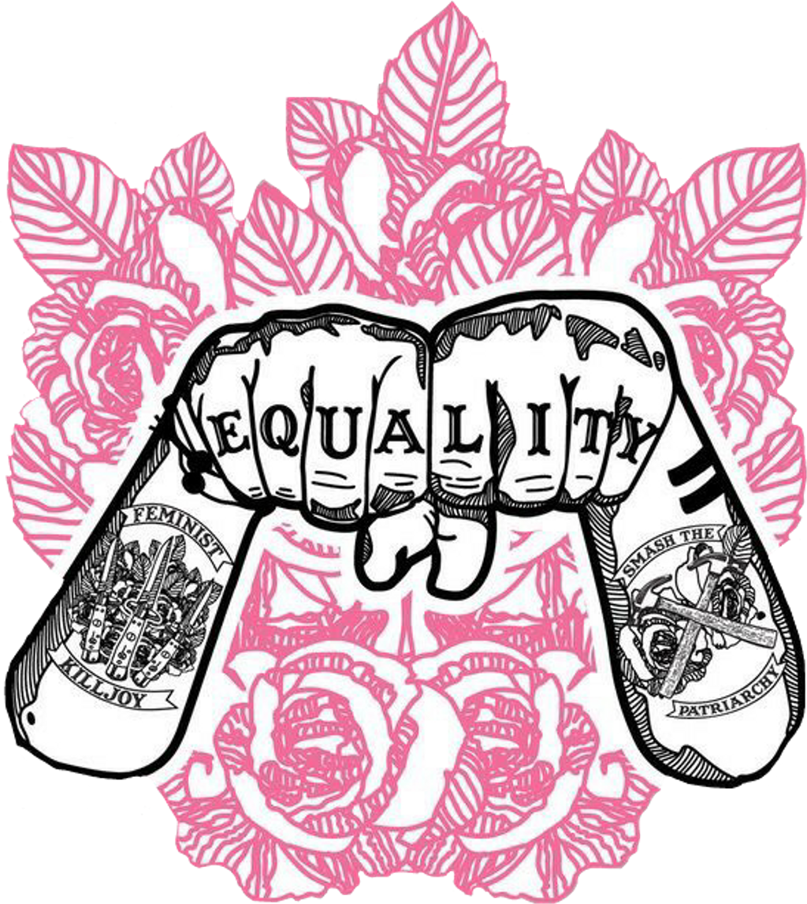

{::options parse_block_html="true" parse_span_html="true" /}

<!-- need to redistribute, change order, decide which to feature, describe, guest discussion -->

<!-- is the love note zine a list that refers out to the code resource hub instead? -->

<main class="zine">
<section class="zine-page page-1" markdown="1">
## Love Notes to Intersectional AI

</section>
<section class="zine-page page-2" markdown="1">
Many, many people believe better AI futures are possible and your inspiration for IAI can draw on a wide range of practitioners already in action!

We're creating an ever-growing master list of projects, tools, resources to learn from. We'd also like to highlight and discuss a few in detail here...

* Deep Lab
* Virtual Care Lab

* Add'l Berlin spaces -- would love to know more!
* other international examples -- would love to know more from outside US & EU!

</section>
<section class="zine-page page-3" markdown="1">
<!-- >**(should all these go in the ccc resource guide & link from there)** -->
<!-- >simple databases are the key to everything, separating data layer from business layer -->
</section>
<section class="zine-page page-4" markdown="1">

## Intersectional Tools & Resources 
<!-- ### Featured?? Which to include -->

### Approaches
* [Not My AI](https://notmy.ai/)
* [Indigenous AI](https://www.indigenous-ai.net/)
* [If AI, Then Feminist](https://netzforma.org/publikation-wenn-ki-dann-feministisch-impulse-aus-wissenschaft-und-aktivismus)
* [Queer.AI](https://queer.ai/) "conversational agents for the advancement of new eroticisms
* [Guidelines for Checking Essential Properties of AI-Based Systems](https://algorithmwatch.org/de/auto-hr/leitfaden/) in German

### Learning AI
- [Elements of AI](https://course.elementsofai.com/)
- [fast.ai course](https://course.fast.ai/videos/?lesson=1) Practical Deep Learning for Coders, Code-First Intro to NLP, Practical Data Ethics [fast.ai]
- [Why.AI](https://www.hiig.de/en/dossier/why-ai/) dossier debunking myths in plain language

#### AI-adjacent but Intersectional Tech
* [@TheAnnaLytical](http://instagram.com/theannalytical) [Anna Lytical Tutorial](https://youtu.be/SpzN47A7gqg) Glamorous Javascript: Makeup and Coding Edition #tutorial
* [Tiny Tools Directory](https://tinytools.directory/) gathers open source tools, small, free or experimental #compendium #collection #tool
* [Cyberfeminist Index](https://cyberfeminismindex.com/) #cyberfeminism #compendium #collection
* [Switching.Software](https://switching.software/list/all-in-one-services/) #deplatforming
* [Oracle for Transfeminist Technologies](https://www.transfeministech.codingrights.org/) by [Coding Rights'](http://codingrights.org/) Joana Varon and Clara Juliano
* [Feminist Data Manifest-NO](https://www.manifestno.com/)
* [Internet Teapot](https://internetteapot.com/) and [Algorithms of Late Capitalism Zines](https://algorithmsoflatecapitalism.tumblr.com/zines), esp. special edition: ["\[D/R\]econstructing AI"](https://href.li/?https://firebasestorage.googleapis.com/v0/b/internet-teapot.appspot.com/o/ALC%20-%20Dreams%20of%20Visionary%20Fiction.pdf?alt=media&token=4c3a9d31-922d-4dbe-9c6f-42fbd69fe312)
* [Algo.Rules](https://algorules.org/en/home)
* [Civic Data Library of Context](https://www.civicdatalibrary.org/)
* [Afrotechtopia](https://www.afrotectopia.org/)
* [Data for Black lives](https://d4bl.org/)
* @datahealing & @cyberdoula (requested permission to be cited)
* [MOTIF feminist futures](https://feministfutures.net/)
* [Superrr](https://superrr.net/) "building diverse & equal futures in tech and beyond"
* [School of Machines, Making, & Make-Believe](http://schoolofma.org/) classes on art, tech, & design

### Examples/Projects
#### Computer Vision
* [Drag Deep Fakes](https://www.youtube.com/watch?v=qQSSl533rb8) Screen Walks. (2021, April 7). Screen Walk with Jake Elwes, Zizi and Me. https://www.youtube.com/watch?v=qQSSl533rb8 #vision #deepfake #gan
* [Library of Missing Datasets](https://github.com/MimiOnuoha/missing-datasets) #datacollection (Mimi Onuoha, see also [*A People's Guide to AI*](https://mimionuoha.com/a-peoples-guide-to-ai), no longer available)
  
<!-- * Aarati Akkapeddi - using libraries image processing colonial archives in india
* Shirley Leung - fed ML Asian American female futurity
* Tona Lopez - Philipines insta, 
* Caroline Sinders
* Ashley Jane Lewis
* Suzanne Kite, indigenous AI -->

#### Conversational Agents
* [Syb Trans Voice Interface](http://syb.feministchatbot.com/)
  * collection of data practices
  * disclosure of team, iterative process
  * personality
  * [Feminist Internet](https://www.feministinternet.com/) "There is no feminism, only possible feminisms. There is no internet, only possible internets."
  * [Feminist Guide to AI Bias (chatbot)](http://about.f-xa.co/2/)
  * [Designing Feminist Chatbots](https://drive.google.com/file/d/0B036SlUSi-z4UkkzYUVGTGdocXc/view?resourcekey=0-DS-Lj4uCk2VHf1cuogGNfg) by Josie Swords @swordstoyoung

### Zines, Principles, Readings, and
* [A is for Another: A Dictionary of AI](https://aisforanother.net/pages/site.html)
* [A New AI Lexicon](https://medium.com/a-new-ai-lexicon/) from AI Now Institute, specifically the first sequence of CARE
* [Detroit Digital Justice Coalition Principles](http://detroitdjc.org/principles/) Access, Participation, Common Ownership, Healthy Communities
* [Tiny Tech Zines](https://tinytechzines.org/)
* [Our Data Bodies' Digital Defense Playbook](https://www.odbproject.org/tools/)
* [Feminist Data Set & Toolkit](https://carolinesinders.com/feminist-data-set/) Caroline Sinders
* [How to Write Non-Violent Creative Code](https://contributors-zine.p5js.org/#reflection-olivia-mckayla-ross)
* [We Need to Talk AI: A Comic Essay](https://weneedtotalk.ai/)
* [Feminist Principles of the Internet](https://feministinternet.org/)

### Tools
* [Anti Capitalist Software License](https://anticapitalist.software/)
* [In Solidarity](https://github.com/marketplace/in-solidarity)
* [Threads](https://cyber.harvard.edu/projects/threads) anonymity in forums tool by Berkman Klein

### Teaching
* [Critical Coding Cookbook](https://parsonsdt.github.io/critical-coding-cookbook/)
* [DecarceratingTheClassroom](https://decarceratingtheclassroom.myportfolio.com/archive)

### Orgs
* [Feminist.AI](https://feminist.ai)
* [Color Coded LA](https://colorcoded.la)
* [JUST AI](https://www.adalovelaceinstitute.org/just-ai/)
* [Coding Rights'](http://codingrights.org/)
* [Black in AI](https://blackinai.github.io/)

#### Additional (not AI specifically but in the spirit of Intersectional Tech)
* [Homebrew Server Club](https://homebrewserver.club/)
* [Lurk](https://lurk.org/)
* [SFPC](https://sfpc.io/)
* [Fix the Glitch Toolkit 2.0](https://glitchcharity.co.uk/wp-content/uploads/2021/04/Glitch-Toolkit-FULL-Interactive.pdf) "Helping to End Online Gender Based Violence for Black Women"
* [Networks of One's Own](https://networksofonesown.constantvzw.org/etherbox/manual.html) publishing an issue as a hardware-software stack with feminist server principles etc. [Issue 2, NoOO: Three Takes on Taking Care](https://networksofonesown.vvvvvvaria.org/)
* [Feminist Infrastructure Zine](https://alexandria.anarchaserver.org/index.php/Feminist_Infrastructure) partially en Español
* [Reclaiming Digital Infrastructures Zine](https://constantvzw.org/documents/RDI/Reclaiming%20Digital%20Infrastructures.pdf)
* [Our Data, Ourselves](https://ourdataourselves.tacticaltech.org/) and the works of [Tactical Tech](https://tacticaltech.org/projects)

#### Web/Code Tools
Many of these were used to make this here zine collection
* [Markdown Cheatsheet](https://devhints.io/markdown)
* [ZineMachine](https://zine-machine.glitch.me/)
* [p5.js]()
* [p5.js Contributors Zine](https://contributors-zine.p5js.org/#read)
* [Github Pages]()
* [Glitch]()
* [Bindery.js]() or [Pages.js]() or [html2print by OSP](http://osp.kitchen/tools/html2print/)

#### Misc tech & publishing fyis
* [How to make a zine](https://thecreativeindependent.com/guides/how-to-make-a-zine/)
<!-- * [exercise exactly 4 min per day](https://substack.net/zine/exercise-exactly-4-minutes-per-day.html) visual example -->

#### Historical zines of interest & related reading
* [Radical Software](https://radicalsoftware.org/e/index.html)
* [*Information Activism: A Queer History of Lesbian Media Technologies*, by Cait McKinney](http://caitmckinney.com/)
  
</section>

<section class="zine-page page-5" markdown="1">

### In Berlin / Other People's Lists
* [CreativeCode.Berlin](https://github.com/CreativeCodeBerlin/creative-coding-minilist)
* []

### Beloved Readings
* Nakamura, Lisa. 2014. "Indigenous Circuits: Navajo Women and the Racialization of Early Electronic Life." The American Studies Association. 
  >"Indian-identified traits and practices such as painstaking attention to craft and an affinity for metalwork and textiles were deployed to position the Navajo on the cutting edge of a technological moment precisely because of their possession of a racialized set of creative cultural skills in traditional, premodern artisanal handwork." (Nakamura 2014, 925)
* 

</section>

<section class="zine-page page-6" markdown="1">
</section>

<section class="zine-page page-7" markdown="1">
</section>

<section class="zine-page page-8" markdown="1">
* Credits & thanks: MA+P, CCC & ppl, HIIG, HiDW, HaCCS, F.AI, Ch510, P5js
* [Creative Code Collective Resource Hub](https://creativecodecollective/resources)
</section>
</main>

[Interspecies Internet](https://www.interspecies.io/about)