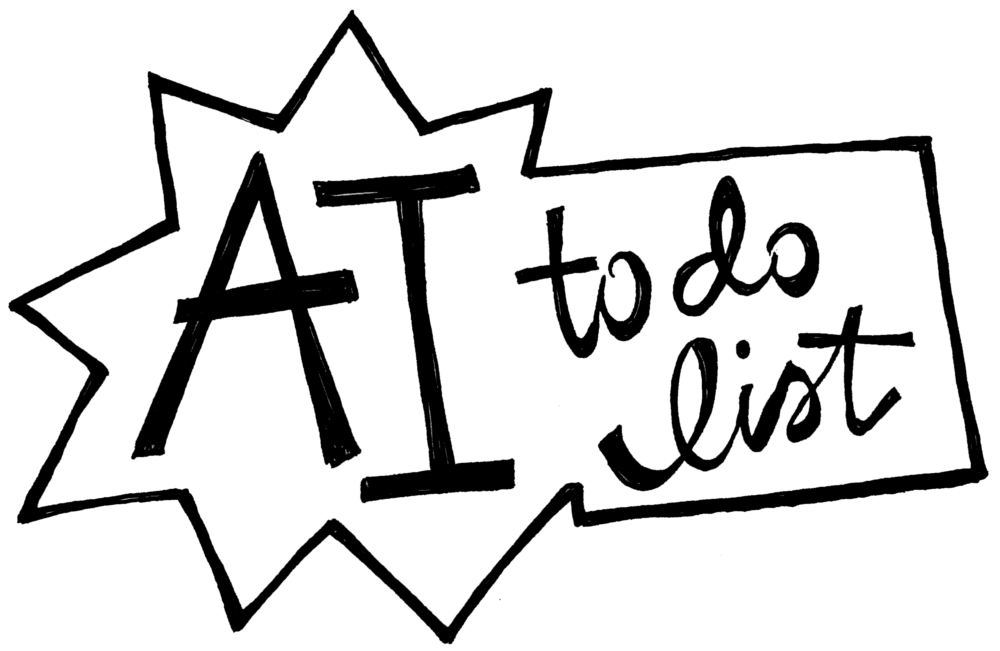
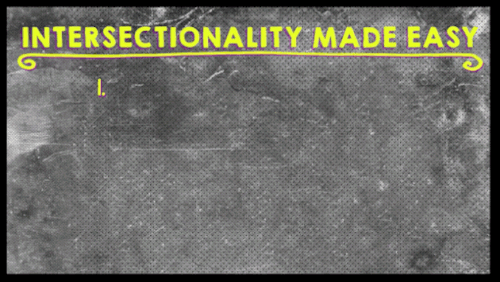
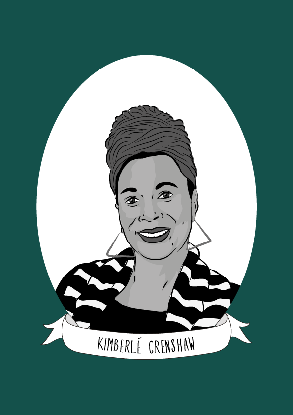

{::options parse_block_html="true" parse_span_html="true" /}

<main class="zine">
<section class="zine-page page-1" markdown="1">

# Why We Need Intersectional AI

{: .small }

#### AI is broken. What is Intersectionality and how can it help?
<!-- >(Critical Theory, So Whats) -->

<!-- --> 
<!-- duckworth intersectionality wheel? -->
  
</section>
<section class="zine-page page-2" markdown="1">

## AI Is Shifting Power

e.g. Christina zur Nedden and Ariana Dongus reported on [involuntary biomentric testing](https://www.zeit.de/digital/datenschutz/2017-12/biometrie-fluechtlinge-cpams-iris-erkennung-zwang) on refugees entering Jordan. 

## Intersectionality Helps Us Understand Power

### What Intersectionality Is

[Laci Green](https://twitter.com/gogreen18) & [Francesca Ramsey](https://twitter.com/chescaleigh)
{: .small .float-left .mr-4 }

<!-- >"Intersectionality is a lens through which you can see where power comes and collides, where it locks and intersects. Is is the acknowledgement that everyone has their own unique experiences of discrimination and privilege." - Kimberlé Crenshaw[^Crenshaw1989] -->

Intersectionality, recently clarified by Dr. Kimberlé Crenshaw who coined the term in 1989, "deals with the interactive effects of multiple forms of discrimination—racism, patriarchy, sexism, misogyny, homophobia. [...] Most importantly, Intersectionality is a frame to tell us what's wrong with the way certain discriminations are thought about. [...] Our understanding of racism [and] sexism is incomplete if it doesn't attend to the intersection of both."[^Crenshaw2021]

"To fully understand how to do equality, [...] you have to see how institutions and vulnerabilities are structured in intersecting ways."[^Crenshaw2021]
<!-- {: .margin-above="-50px" } -->

 

"The fundamental thing to remember is that for the most part 'Isms'—racism, classism—are often framed through the experiences of those who are dominant within the group, and more times than not that's men. And because we don't understand racism as it plays out between women, or racism as creating burdens on someone that others don't have,  because we don't have that understanding, we often run up against the limitations of that frame when it's disproportionately women of a particular background or context who are being impacted by something."[^Crenshaw2021]

<!-- {: .small .float-left .mr-4 } -->

[Dr. Kimberlé Crenshaw, 2015,  Illustrated Women in History](https://illustratedwomeninhistory.com/kimberle-crenshaw-is-an-american-scholar-in-the/){: .small .float-left .mr-4 } 

"Intersectionality is an institutionalized historical advantage for white men. [...] We see hierarchy and we see the way things are supposed to be through a lens that's already intersectional. ~~It's only when there are people who are challenging that, saying it's unfair or unjust, that people see a problem [...].~~ So yes, intersectionality marks power, as well as exclusion. If we take it seriously it gives us a clue about the ways we need to rethink how our institutions function, what it values, what it should value, in order to make more equitable more institutional practices."[^Crenshaw2021]

<caption>—Dr. Kimberlé Crenshaw</caption>

"Intersectionality is actually a beautiful and brilliant tool for coalition making."[^Crenshaw2021]
<caption>—Juliana Hu Pegues</caption>

### What Intersectionality Is NOT

"it's an analytic tool, not a hierarchy [...] it is not identity politics on steroids"[^Crenshaw2021]

"Intersectionality is not just about identities apart from the structures that make those identities salient. [...] It's not in the body; it's in how the body is situated in the society in which we live. And that's the piece that people often get confused about."[^Crenshaw2021] 

"Intersectionality is a dynamic idea. It's not flat, it's not predetermined, it's not a formula. It's a way of seeing, it's a way of looking, it's an imperative that says if we want to be more equal we have to be better prepared to see where any inequality exists. That's what Intersectionality does, that's what it's for."[^Crenshaw2021]

"Intersectionality is contextually specific. I say it again. When we're talking about the low wages of working class women, that often includes white working class women as well. [...] Whiteness isn't protecting them from class and gender inequality in the way that whiteness sometimes provides insulation from other forms of inequality. That is the point of intersectionality. It's not a one-size-fits-all, it's not a prism that always predicts who's on top and who's on bottom."[^Crenshaw2021]

<iframe src="https://www.npr.org/player/embed/982357959/982371588" width="100%" height="290" frameborder="0" scrolling="no" title="NPR embedded audio player"></iframe>

[^Crenshaw1989]: Crenshaw, K. (2015). Demarginalizing the Intersection of Race and Sex: A Black Feminist Critique of Antidiscrimination Doctrine, Feminist Theory and Antiracist Politics. University of Chicago Legal Forum, 1989(1). https://chicagounbound.uchicago.edu/uclf/vol1989/iss1/8
[^Crenshaw2021]: Crenshaw, K. (2021, March 29). What Does Intersectionality Mean? : 1A. https://www.npr.org/2021/03/29/982357959/what-does-intersectionality-mean

</section>

<section class="zine-page page-3" markdown="1">

## What Intersectionality Offers to Technology

### Critical lenses

### Practical tactics

### A meta-ethics of multiplicity

</section>

<section class="zine-page page-4" markdown="1">

## Whiteness & AI

### Characteristics of white supremacy
[source]() zine

### From inclusion to decentering
Representation is not enough; labor is present but unseen, in global south and undervalued. Not about code bootcamps but valued voices. 
[source]() Dunbar-Hester, et al

</section>
<section class="zine-page page-5" markdown="1">

## Race Is A Technology
[source]() Lisa Nakamura, Wendy Chun, et al
Race as algorithm, Sareeta Amrute

### Algorithmic histories predict futures
[source]() Dark Matters, et al

</section>
<section class="zine-page page-6" markdown="1">

### Alternative histories & approaches
[source]() <!--expand if Xin Xin is open to this-->

</section>
<section class="zine-page page-7" markdown="1">

</section>
<section class="zine-page page-8" markdown="1">

### The reach of AI requires Intersectionality at every level

#### Sources

#### Issues in this zine collection
<!--visit site-->

</section>
</main>

## Missing
Who do we mean, what theories to focus on

## Where to put these? 
Race-Critical Code Studies
Restorative Processing, infrastructures of care