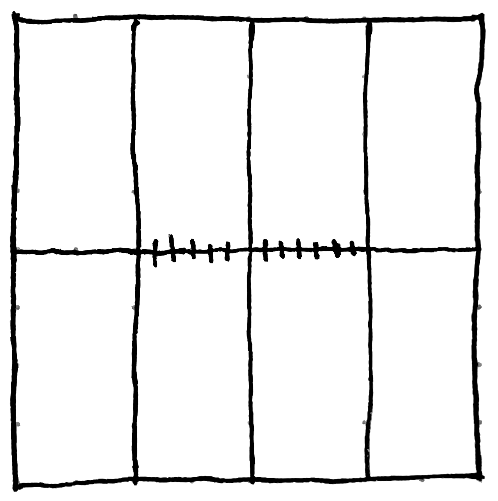
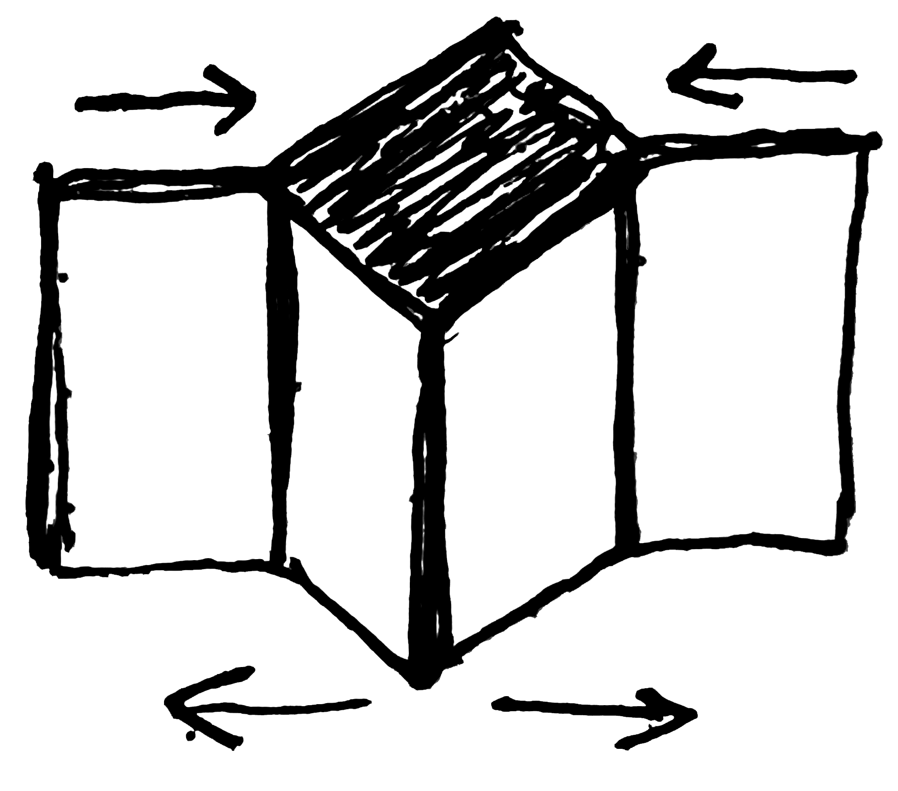

<!-- ## Intersectional AI Toolkit -->

<main>
<section class="zine-page page-1" markdown="1">

## 📕 What is the *Intersectional AI Toolkit*?

#### a zine collection and code resource hub for artists, activists, engineers, and you

The Intersectional AI Toolkit gathers ideas, ethics, and tactics for creating and supporting more ethical, equitable tech. It shows how established queer, anti-racist, anti-ableist, feminist communities contribute necessary perspectives to reshaping the digital systems that affect us all. The toolkit also offers approachable guides to both intersectionality and AI. This endeavor works from the hope that code can feel approachable for everyone, can move us toward care and repair—rather than perpetuating power imbalances—and can do so by embodying lessons from intersectionality.

Of course, this toolkit is not the first or only resource on intersectionality or AI. Instead, it gathers together some of the amazing people, ideas, and forces working to re-examine the foundational assumptions built into these technologies. In the tradition of '90s zine aesthetics and politics, it celebrates these radical efforts by sharing them—connecting concepts, creators, tools, and tactics across disciplines and counter-histories—hoping to spark further conversation and collaboration. It does so imperfectly and incrementally, showing rough edges and edit marks, in the belief that no text is final, all code can be forked, and everything is better with friends. 

Please join in by exploring the toolkit, commenting with your questions or thoughts, or remixing it into your own new text(s). No experience is necessary to participate; all backgrounds and perspectives are welcome!

---

## What's included? 

### 📠 Zine collection 

#### The zine collection is planned out as 6+ issues—printable as double-sided zines—and readable, remixable, shareable. 

1. [🍦🍦 A-to-Z IAI](posts/Glossary.md) Glossaries for its tech and its social sides
2. [💜 Love Notes to IAI](posts/LoveNotes.md) Great practitioners and projects already at work
3. [🔥 Why We Need IAI](posts/WhyAI.md) Making the case for more equitable, empathic tech
4. [🌶Tactics](posts/Tactics.md) Practical approaches from wide-ranging communities and decades of intersectional effort
5. [😍 Help Me Code IAI](posts/NoCode.md) Afraid of programming but want to save AI from itself? 
6. [🤩 Help Me Understand](posts/HelpMeGetIt.md) Why listen to academic, activist, or artistic approaches?

#### More resources to come!

<!-- * [🤩 What AI Engineers Can Learn from Artists & Activists](posts/Techies.md) Help me help you. I want to care but I don't get it. How can I better understand the cause? -->
* [Coding Care: Community Ethics for Collective Digital Care](posts/Caring.md) What values and strategies does it take to support those creating intersectional approaches to tech? Plus, lessons learned and strategies gained from growing [Creative Code Collective][CCC].

  
### 🤖 Code resource hub
  
#### The code resource hub will be an ever-growing community-sourced collection of video tutorials, code libraries, and inspiring projects. 

These have been curated by members of [Creative Code Collective][CCC] and friends. They will point you to the many different kinds of projects, tools, and research being made around Intersectional AI and related topics. It's fed by a user-friendly spreadsheet where you can add your own resources and tell us why you like them. Get inspired and you can get cracking making your own intersectional projects and tools for others.

---

</section>

<section class="zine-page page-2" markdown="1">

<!-- ## Why make an IAI TK?  -->

## 😁 How do I fold these print-at-home zines? 

{: .small } {: .small }

1. fold your paper in half long ways, so that it is long and narrow. crease well, then unfold.
2. fold your paper in half along the short side, and fold that in half again. crease well, then unfold.
3. you should have eight mini sections divided like the illustration above. 
4. cut *ONLY* along the two short folds in the middle. this is easiest done by folding the paper in half once short ways again and taking the scissors halfway in on the side with the fold (not the side that is open). do not cut all the way across. the goal is to have a slice in the center that does not connect to any edges.
5. finally, fold the paper in half long ways again so the printed side faces out. pinch open the sliced center and separate those pages apart from each other until they join their neighbors.
6. fold the book closed with the covers on the front and back.

<!-- 
my 12-up zine
1. fold your paper into three equal parts, as though you were going to put it into a business envelope. crease well, then unfold.
2. fold into two equal parts the other direction, like a book. crease well, then unfold.
3. make two small cuts 
4. 
-->

### ... and it's pronounced *zeen*, right? 
Yep, like "magazine." Like, "I'm so excited to read this *zeeeeeeen*!"

## 🤓 Who's making this IAI TK? 

Developed by Sarah Ciston while a virtual fellow at the HIIG, with valued inspiration and collaboration from many others included on the [Community page](pages/Community/#imprint)

See [Notes](pages/Notes.md) for more on Sarah's making of this collection-in-progress and read more below about how you can help it grow.

## 😎 ...and how can I contribute? 

#### • making github comments, browsing the diffs

There are many ways to contribute. One of the most immediate is to join in the co-creation of these texts! Feel free to read along, and add your thoughts on the project's [github archive](https://github.com/sarahciston/intersectionalai). I think of this as an expanded form of reading-writing.

1. At the bottom of any page on this site, you'll see a link to "Comment, edit, or remix this page on Github." When you follow it, you reach the code for this page and all the files that run this site. 
2. If you go to the [main page](https://github.com/sarahciston/intersectionalai), at the top you'll see a link that says **Fork** (make sure you're logged in to your own GitHub account first). Forking this repository makes a copy of the site that's all yours and let's you make whatever changes you want! You'll see that now the repo says `/yourname/intersectionalai/`
3. Click around to the files you want to dive into. In the blue bar at the top of each, click the **History** button which will take you into the archives for this particular file. Don't worry you can't break anything. 
4. Here you'll get a list of every **Commit**, which are labels put on each time changes have been saved to the repository. They'll have random names like, "Updated a typo" or "Redid everything FML why did it break!!!" because sometimes I'm not good at clearly labeled commits. Click the top link in the list (latest), or rewind to an earlier version if you like. *Follow along with the drama, ghasp!*
5. Now you have a colorful look at every change or "diff"—green + for adds and red - for deletes—made to each file. AND when you point your cursor at a line, a blue + plus appears at the left edge, where you can click to leave a comment about that line! If you're in "raw text" mode you'll also see other readers' comments, plus the non-formatted code as well.

[comprehensive Github cheatsheet](https://github.com/tiimgreen/github-cheat-sheet)

#### • adding your thoughts, edits, sections, pages in markdown style 

How do I format my contribution? 

[Handy Markdown](https://devhints.io/markdown)
[Official Markdown](https://kramdown.gettalong.org/quickref.html) 
[Printable Markdown cheatsheet](https://packetlife.net/media/library/16/Markdown.pdf)

<!-- #### • joining the discord -->

<!-- ### • joining an in-person event or watching& sharing the live-streams, artist videos, and media of our contributors & friends -->

<!-- #### • keeping an interdisciplinary, intersectional mindset -->

---

Distributed by an [Anti-Capitalist Software License](https://anticapitalist.software").
{:.caption }

[CCC]: https://creativecodecollective.com
</section>
</main>

<!-- 👏📚🤑 -->

 

	

<!-- https://h.readthedocs.io/en/latest/api-reference/ -->
<!-- https://scalar.usc.edu/works/guide2/scalarapi -->
<!-- https://scalar.usc.edu/works/guide2 -->